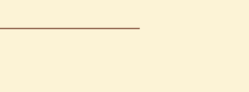
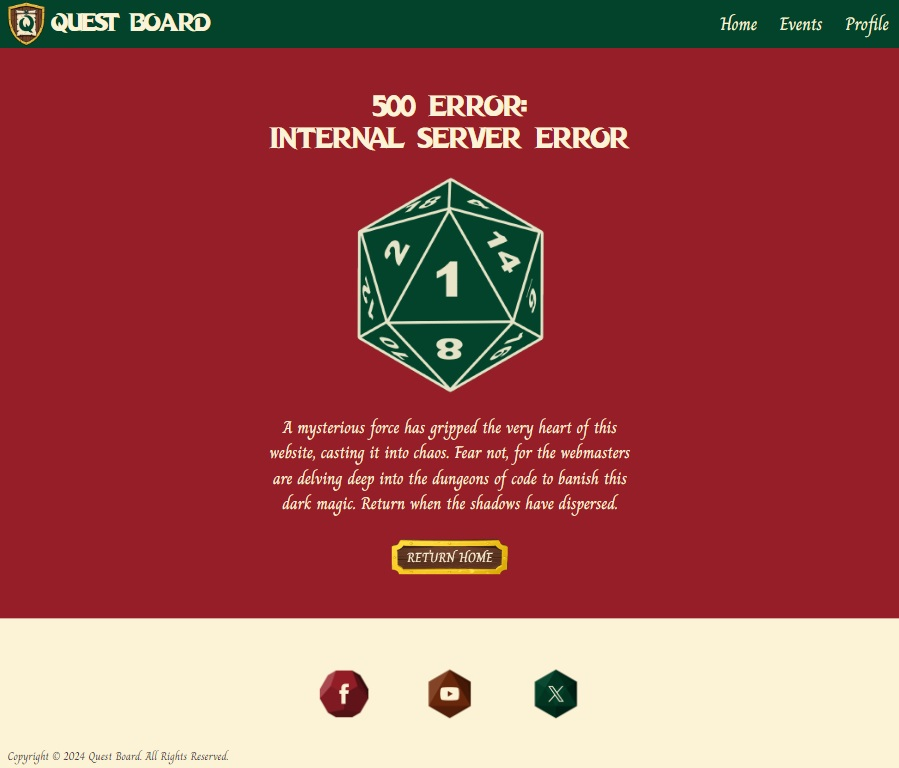

# **Quest Board** <!-- omit in toc -->

## **Welcome to Quest Board: Your Gateway to D&D Adventures in South Wales** <!-- omit in toc -->

Quest Board is more than just a website; it's a thriving community crafted for Dungeons & Dragons enthusiasts in South Wales. Whether you're a seasoned adventurer or a novice seeking your first quest, this is the place to connect with like-minded individuals, create memorable events, and embark on epic journeys together.

So sharpen those pencils, dust off your dice, and prepare for adventure!

This project was created as part of the Code Institute Level 5 Diploma in Web Application Development course.

[Click here to visit Quest Board]()

**By [Andrew Wright](https://github.com/AndyWright360)**

---

## **Contents** <!-- omit in toc --> 

- [**User Experience (UX)**](#user-experience-ux)
  - [**Initial Concept**](#initial-concept)
  - [**User Stories**](#user-stories)
- [**Design**](#design)
  - [**Colour Scheme**](#colour-scheme)
    - [**Primary Palette**](#primary-palette)
    - [**Additional Colours**](#additional-colours)
  - [**Typography**](#typography)
    - [**Dragon Hunter**](#dragon-hunter)
    - [**Charm**](#charm)
  - [**Imagery**](#imagery)
  - [**Wireframes**](#wireframes)
    - [**Home Page**](#home-page)
    - [**Events Page**](#events-page)
    - [**Event Page**](#event-page)
    - [**Create Event Page**](#create-event-page)
    - [**Edit Event Page**](#edit-event-page)
    - [**Sign Up Page**](#sign-up-page)
    - [**Login Page**](#login-page)
    - [**Profile Page**](#profile-page)
- [**Features**](#features)
  - [**General Features**](#general-features)
    - [**Responsive Design**](#responsive-design)
    - [**Page Heading**](#page-heading)
    - [**Navbar**](#navbar)
    - [**Flash Messages**](#flash-messages)
    - [**Footer**](#footer)
    - [**Buttons**](#buttons)
  - [**Home Page**](#home-page)
  - [**Sign Up/Login Page**](#sign-up/login-page)
  - [**Profile Page**](#profile-page)
  - [**Events Page**](#events-page)
  - [**Event Page**](#event-page)
  - [**Create/Edit Event Page**](#create/edit-event-page)
  - [**Error Pages**](#error-pages)
  - [**Future Implementations**](#future-implementations)
    - [**Profile Personalisation**](#profile-personalisation)
    - [**Party Creation**](#party-creation)
    - [**Message System**](#message-system)
- [**Technologies Used**](#technologies-used)
  - [**Languages Used**](#languages-used)
  - [**Frameworks, Libraries \& Programs Used**](#frameworks-libraries--programs-used)
- [**Deployment \& Local Development**](#deployment--local-development)
  - [**Deployment**](#deployment)
  - [**Local Development**](#local-development)
    - [**How to Fork**](#how-to-fork)
    - [**How to Clone**](#how-to-clone)
- [**Testing**](#testing)
- [**Credits**](#credits)
  - [**Code Used**](#code-used)
  - [**Content**](#content)
  - [**Media**](#media)
    - [**AI Generated Images**](#ai-generated-images)
    - [**Footer Icons**](#footer-icons)
    - [**Home Page Images**](#home-page-images)
    - [**Events Page Images**](#events-page-images)
    - [**Create Event Images**](#create-event-images)
    - [**Error Page Images**](#error-page-images)
  - [**Acknowledgments**](#acknowledgments)

--- 

## **User Experience (UX)**

### **Initial Concept**

The vision behind this project was to develop a website that could foster a community of Dungeons & Dragons players in South Wales. The primary objective was to design a platform that serves as an entry point for newcomers while simultaneously delivering value to more experienced players. To achieve this, the website was crafted with a user-friendly interface, ensuring easy navigation and allowing users to effortlessly create and participate in events.

From a visual perspective, the goal was to theme the website on the fantastical elements of Dungeons & Dragons. The design concept draws from the idea of quests being posted on a message board for adventurers.

### **User Stories**

- **First Time Visitor Goals**

    1. I want to create a profile so that I can start creating and joining events.
    2. I want to filter events based on store location to find events in my preferred area.
    3. I want to view the details of an event to ensure it aligns with my preferences and schedule.

- **Returning Visitor Goals**

    1. I want to log in to my account.
    2. I want to join an event created by another user.
    3. I want to edit the details of an event in case there are changes or updates.

- **Frequent User Goals**

    1. I want to check my profile page so I can easily monitor my created and joined events.
    2. I want to leave an event if my plans change or I can no longer attend.

- **Administrator**

    1. I want to review and moderate user-created events to ensure they comply with community guidelines.

---

## **Design**

### **Colour Scheme**

#### **Primary Palette**

The colour scheme was inspired by the Welsh flag, not only as a nod to the location of the events but also to infuse a sense of regional identity into the platform. This design element aims to enhance the overall sense of community within the South Wales Dungeons & Dragons player base.

#### **Additional Colours**

These additional colours were chosen to complement the primary colour scheme and enhance the visual depth of the website. Light brown was chosen as an alternative font colour, applied to labels for form inputs. Yellow accents were incorporated into various elements to evoke the appearance of golden decorative trim. This colour was also used as the background for Flash messages, ensuring they catch the user's attention. Green was applied to the "sign up" and "log in" links, making them more prominent. The lighter shade of green was employed as an alternative section colour for pages predominantly themed in green.

### **Typography**

#### **Dragon Hunter**

Dragon Hunter was the font used for the headings of the website. The font was chosen to evoke the fantasy theme of the site and establish a thematic connection to Dungeons & Dragons.

#### **Charm**

Charm was used for all other text content throughout the site. This font was chosen for its handwritten style, adding a touch of enchantment to the overall design. To maintain legibility, I implemented a high-contrast colour scheme and increased the font size for enhanced clarity.

### **Imagery**

The central theme guiding the visual design of this website is to capture the fun and approachable essence of Dungeons & Dragons. To embody this, I opted for an animated visual style, incorporating many playful elements throughout the website.

The goal was to integrate the fantastical world of the game into every aspect of the site. Notably, the Google Maps feature was styled to resemble an adventurer's map, and the side navigation bar was crafted to mirror the appearance of a knight's banner.

At the heart of the site's concept was the idea of adventurers receiving quests from a message board. To achieve this, I designed the user created events to resemble sheets of parchment paper. Placing them against a wooden background to evoke the essence of a message board. I aimed to spark the imaginations of the users, encouraging them to take part and become active members of the community. These elements were also incorporated into the logo, for a more cohesive design.

### **Wireframes**

Wireframes were generated using Balsamiq for desktop, tablet, and mobile screen dimensions, ensuring a responsive design. This method aids in visualising and configuring the layout, allowing for a more uniformed user experience across various devices.

#### **Home Page**

#### **Events Page**

#### **Event Page**

#### **Create Event Page**

#### **Edit Event Page**

#### **Sign Up Page**

#### **Login Page**

#### **Profile Page**

---

## **Features**

### **General Features**

#### **Responsive Design**

Screenshots

*Responsive Layout*

- **Responsive:** The layout adjusts to different device widths, providing users with a smooth experience across multiple devices. This improves both accessibility and usability.

#### **Page Heading**

Screenshots

*Page Heading*

*Repeatable Pattern*

- **Heading Design:** The heading of each page was designed to resemble torn parchment paper, aligning with the fantastical design aesthetic.

- **Repeatable Pattern:** The image is seamlessly repeatable, ensuring consistent quality across various screen widths.

#### **Navbar**

Screenshots

*Navbar*

*Navbar - Hover*

*Sidenav*

*Sidenav - Hover*

*Active Links*

- **Alternative Colour Scheme:** Implemented a variation between red and green navbars to provide an alternative colour scheme across the site. This variation distinguishes between primary site pages (e.g. home page, events page) and secondary pages (e.g. edit events, sign up).

- **Nav Link Hover Effect:** Applied a hover effect to navbar links to provide users with visual feedback as they select their desired link, enhancing the interactive experience.

- **Sidenav Design:** The sidenav was designed to resemble a medieval banner, aligning with the fantasy adventure visual theme of the website. This design element adds a thematic touch to the navigation experience.

- **Logo Navigation:** The website logo serves as a consistent link to return home, ensuring easy navigation back to the home page from any section of the site. This contributes to a seamless user experience by providing a familiar and intuitive method of navigation.

- **Active Links:** Utilised to aid users in navigating the site, making it easier for them to identify the current page they're viewing.

#### **Flash Messages**

Screenshots

*Flash Message*

- **Flash Messages:** Serve as a communication tool by providing feedback to users after executing an action or correcting an error. They convey the successful completion of a task while also guiding users on how to input valid data.

#### **Footer**

Screenshots

*Footer Design*

*Icon Design*

*Icon Hover*

- **Icon Design:** The design of the social media icons was crafted to resemble dice, maintaining thematic consistency across the entire page.

- **Icon Hover Feedback:** Links expand in size when users hover their mouse over them, suggesting interactivity and enhancing user engagement.

#### **Buttons**

Screenshots

*Button Design*

*Button Hover*

*Click Animation*

- **Button Design:** The buttons were fashioned to mirror the appearance of message boards, aligning them thematically with the core design.

- **Mouse Hover Feedback:** Upon mouse hover, the buttons enlarge to offer interactive feedback, enhancing the user experience.

- **Click Animation:** When clicked, the buttons will subtly shrink to simulate the action of being pressed, offering visual feedback to the user.

### **Home Page**

Screenshots

*Home Page*

*Hero Image*

*Our Quest*

*Locations*

*Map*

*Gallery*

*Gallery Auto-Play*

- **Hero Image Design:** The design of the hero image was intended to capture the imaginations of the users. The concept being that the world of the game is being brought to life around the players. The colour palette was adjusted to better suit the theming of the website. A large red dragon is pictured centrally as a nod to the Welsh dragon.

- **Introduction:** The "Our Quest" section serves as a short blurb, summarising the website's purpose for users.

- **Interactive Map Elements:** Partner game store locations are highlighted on the map, each revealing key information upon mouse click.

- **Map Visual Design:** The map was crafted to resemble an adventurer's treasure map, adding a thematic touch to the overall style.

- **Auto-Play Gallery:** The gallery features an auto-play function, scrolling through each image on a timer. The images depict past events, offering users a visual preview of what to anticipate from upcoming gatherings.

### **Sign Up/Login Page**

Screenshots

*Sign Up Page*

*Login Page*

*Input Validation*

*Character Limit*

*Character Counter*

*Required Input Notification*

*Helper Text*

*Input Pattern Recognition*

*Confirm Password*

*Navigation*

- **Visual Feedback:** Utilising Materialize validation classes, input borders change colour to green for valid inputs and red for invalid inputs. Providing users with immediate visual feedback on the validity of their input.

- **Character Limitation:** Implemented a 15-character limitation on input fields, preventing users from exceeding the specified limit and ensuring data integrity.

- **Character Counter:** Integrated Materialize character counter to dynamically display the current character count. Assisting users in staying within the specified character limits.

- **Required Field Indication:** Applied the required attribute to username and password input fields. Prompting users to complete all required inputs before submission and providing notification if incomplete data is detected.

- **Helper Text:** Included helper text to clearly communicate character count requirements, aiding users in understanding input expectations.

- **Pattern Recognition:** Implemented pattern recognition on input fields to ensure the submission of correct data. Notifying users if invalid characters are entered and guiding them to input valid information.

- **Confirm Password:** Added to improve the sign-up user experience and prevent unintentional spelling errors when creating a user profile.

- **Convenient Navigation:** Included links to the login/sign up page on both pages, ensuring easy navigation between pages and enhancing the user experience.

### **Profile Page**

Screenshots

*Profile Page*

*Profile Heading*

*No Events Message*

*Delete Modal*

- **Personalised Heading:** The page heading is dynamically set to the username of the logged-in user, adding a personalised touch to the user's experience.

- **Centralised Event Management:** Access to all events created and joined by the user is provided, allowing easy management within a single space. User-created and joined events are arranged into separate sections for enhanced clarity and organisation.

- **No Events Message:** In case no created or joined events exist, a message prompts the user to either create a new event or explore existing events on the events page. This encourages user engagement and activity to further foster a sense of community amoungst users.

- **Delete Modal:** Upon clicking the 'Delete' button, a modal will appear to confirm that the user wants to proceed with this action.

### **Events Page**

Screenshots

*Events Page*

*Events Board*

*Filter*

*Edit & Delete Buttons*

*Join & Leave Buttons*

*Event Full*

*Delete Modal*

*User Instruction*

*User Authentication*

- **Events Page Design:** The events page was crafted to emulate adventurers gathering quests from a message board.

- **Board Design:** To enhance this theme, the event container adopts the appearance of a wooden board with metal trim, while the events themselves are represented as paper notes.

- **Repeatable Pattern:** Both the bordered container and wooden slat background are endlessly repeatable, ensuring adaptability to any screen size without distortion or loss of image quality.

- **Filter Design:** The filter system at the top of the page features a companion downward arrow icon. Signalling to users that additional information is available.

- **Filter Search:** Upon click, the search categories become visible, aiding users in refining their requirements.

- **Search Options:** Multiple options can be selected to provide more tailored search criteria.

- **Edit & Delete Events:** For events created by the current user, edit and delete option buttons are visible.

- **Join & Leave Events:** Events created by other users will instead display a "join" button, which changes to "leave" if the user has already joined the event.

- **Feedback on Full Events:** Once the maximum party members have been reached, a "full" stamp will replace the "join" button, signaling to users that the event is at capacity and can no longer be joined.

- **Deletion Notification:** A modal prompts user confirmation to delete an event, preventing accidental selections that can't be undone.

- **User Instruction:** Positioned prominently at the top of the page, a notification prompts users to interact with event stamps for additional information. This provides the user with clear instruction on how to use the feature.

- **User Authentication Requirement:** To access this page, users must be signed in to their account. If a user attempts to access the page without being signed in, they will be automatically redirected to the sign-up page. A clear notification will inform them of the sign-in requirement, ensuring a seamless and guided user experience.

### **Event Page**

Screenshots

*Event Page*

*Party Member List*

*Edit & Delete Buttons*

*Delete Modal*

*Join/Leave Party*

- **Event Details:** This page provides additional details about the event, aiming to give users all the relevant information they may require.

- **Party Member List:** The number of available party member spaces are displayed in the form of a list. As users join the event, their usernames dynamically populate the list, reflecting the current participant count.

- **Edit & Delete:** Users are able to edit or delete events they have created from this page.

- **Join & Leave:** Users can join or leave events created by other users form this page.

### **Create/Edit Event Page**

Screenshots

*Create Event Page*

*Edit Event Page*

*Character Counter*

*Helper Text*

*Invalid Input*

*Required Input Notification*

*Date Picker*

*Popover Messages*

*Colour-Coded Stamps*

*Input Validation*

The form on this page incorporates several features aimed at helping users understand the required information and how to address any errors.

- **Character Counter:** Text inputs with character limits display a character counter, offering users a visual cue on their input progress.

- **Helper Text:** Helper text accompanies the max-party input, providing clarity regarding the available number range.

- **Invalid Input Notification:** Data error messages are included for text inputs, offering guidance to users in case of invalid entries.

- **Required Field Indication:** Required inputs are marked to alert users to any missed fields during submission.

- **Input Validation:** Implemented for text and number fields, visually indicating validity with green or invalidity with red cues.

- **Date Picker:** Implemented the Materialize date picker modal. Offering users an intuitive way to input dates that was easily customisable to match the colour theme of the website. 

- **Popover Messages:** Added to the experience level radio inputs. Offering clear descriptions of each experience level's purpose.

- **Colour-Coded Stamps:** Images representing different experience levels are colour-coded like traffic lights. The intention was to create an intuitive understanding of each level's significance.

- **Pre-populated Inputs:** When editing an event, the form fields will be pre-populated with the existing data. This feature eliminates the need for users to re-enter all information, enabling them to conveniently modify specific details as needed.

- **Input Validation:** To guarantee that users provide the necessary data, validation checks were integrated into various inputs. These include prohibiting users from selecting an event date in the past, preventing the input of whitespace-only characters for text inputs, and disallowing text inputs from starting or ending with a space.

### **Error Pages**

Screenshots

*400 Error Page*

*403 Error Page*

*404 Error Page*

*500 Error Page*

*Link Home*

- **Error Image:** The prominant image of each page is of a D20 that has landed on a 1. This references the game of Dungeons & Dragons and is the lowest roll that can occur when attempting an action.

- **Error Message:** The error message for each page is written from a Dungeon Master's perpective to a player. Offering a humerous explanation of the error tailored to the fantasy theme.

- **Return Home Button:** Prominently placed on each page, the "Return Home" button offers straightforward navigation. Allowing users to easily return to the main page.

### **Future Implementations**

#### **Profile Personalisation**

Enhance user profiles with customisable features, including profile images, short bios, and character information and stats. Allowing users to express themselves and showcase their character creations.

#### **Party Creation**

Enable users to create and join parties with other members, fostering a stronger sense of community. Parties can collaborate on events and adventures, enhancing teamwork and camaraderie among users.

#### **Message System**

Implement a messaging system within events and user parties, facilitating communication among players. This would enhance event organisation and coordination, allowing users to discuss plans and make arrangements with ease.

#### **Background Image Failsafe**

Given that many content containers rely on background images, there's a concern regarding font readability should these images fail to load. As the images have tranparent elements, the option to include a background colour wasn't available. To address this, I intend to implement a feature in the future as a failsafe measure. This could involve using JavaScript to check if the image has loaded, and if not, provide an alternative option. Alternatively, divs with background colors could be positioned absolutely behind the background image, using z-index to keep them hidden unless the image fails to load.

---

## **Technologies Used**

### **Languages Used**

- HTML5
- CSS3
- JavaScript
- Python

### **Frameworks, Libraries & Programs Used**

- **Codeanywhere & Gitpod**
    
    - Utilised for version control, employing the terminal to commit and push changes seamlessly to GitHub.

- **GitHub**
    
    - Functions as the repository for securely storing the project's code after it's been pushed from Codeanywhere.

- **Heroku**
    
    - Serves as the platform for deploying the live site.

- **Materialize v1.0.0**

    - Utilised for website layout and responsive design features. The site incorporates Materialize components such as the navbar and carousel.

- **Google Fonts**

    - The 'Charm' font is the primary typeface consistently used throughout the entire project.

- **Font Awesome**

    - Used to incorporate icons on Google Map pins, uniquely identifying each game store.

- **Pixlr**

    - Applied for image modifications, including adjustments to colouring and resizing.

- **Balsamiq**

    - Utilised during the design stage for creating wireframes.

- **XnConvert**

    - Employed to convert all image files from JPEG and PNG formats to WebP.

- **TinyPNG**

    - Used to compress image files, contributing to enhanced performance.

- **ScreenToGif**

    - Implemented for capturing screen recordings saved as gif files.

- **Google Chrome Dev Tools**

    - Utilised to inspect page elements, debug site issues, and test responsiveness on various mockup devices.

- **Google Maps API**

    - Linked to the Google Maps API to load the relevant map location and generate clickable markers.

- **PostgreSQL**

    - Utilised as a relational database to store both user and event data.

- **Flask**

    - A micro-framework employed in the development of the website.

- **SQLAlchemy**

    - A database abstraction library utilised for interacting with PostgreSQL.

- **JQuery**

    - A JavaScript library that was primarily used to initialise Materialize features.

- **Am I Responsive?**

    - Implemented to showcase the website image across a variety of devices.

- **Lucid**

    - Utilised for the creation of the database schema.

---

## **Deployment & Local Development**

### **Deployment**

### **Local Development**

#### **How to Fork**

---

## **Testing**

For a detailed overview of all conducted testing, please refer to the [TESTING.md](TESTING.md) file.

---

## **Credits**

### **Code Used** 

- [Remove jittery text on scale increase for buttons by Chris W](https://stackoverflow.com/questions/52708013/wobbly-text-on-transform-scale)

  - This code was employed as a bug fix to provide a smoother transition for the button hover effect.

- [Remove number input arrows from W3Schools](https://www.w3schools.com/howto/howto_css_hide_arrow_number.asp)

  - This code was used to remove the default arrows on number inputs across multiple browsers.

- [Popover messages by Mihael Tomić](https://codepen.io/mihaeltomic/pen/PqxVaq)

  - Enabled the implementation of popover messages to describe experience levels to users during event creation. 

- [Interactive map markers from Google Maps Documentation](https://developers.google.com/maps/documentation/javascript/examples/advanced-markers-html)

  - This documentation helped me to implement custom interactive Google map markers.

- [Checkbox Filtering with Subfilters by Kassandra Flanders](https://codepen.io/tornadicshark/pen/XWboaRp?editors=1010)

  - This code helped me create the filter search functionalitly across multiple categories.

- [User Registration Page with Flask-SQLAlchemy & PostgreSQL by Sandeep Sudhakaran](https://www.youtube.com/watch?v=7EeAZx78P2U)

  - This tutorial helped me to understand how to check if a username already existed within a PostgreSQL database.

### **Content**

All content for the website was written by the developer Andrew Wright.

### **Media**

The majority of images used on the website we're obtained from the following websites:

- [Freepik](https://www.freepik.com/)
- [Pngtree](https://pngtree.com/)
- [Pixabay](https://pixabay.com/)

Additional images were AI generated using Microsoft Copilot.

#### **AI Generated Images**

- Hero Image

- Gallery Images

- Quest Board Logo

- Events Board Metal Trim

#### **Footer Icons**

- [D20 Icon](https://www.freepik.com/icon/octahedron_3810286#fromView=resource_detail&position=0)

- [D12 Icon](https://www.freepik.com/icon/dodecahedron_3810289#fromView=resource_detail&position=0)

- [D8 Icon](https://www.freepik.com/icon/icosahedron_3810283#fromView=resource_detail&position=1)

- [Facebook Icon](https://www.freepik.com/icon/facebook-logo_49052#fromView=search&page=1&position=9&uuid=8c7a5de0-c86c-46e9-a924-4b4a6b6d35b0)

- [YouTube Icon](https://www.freepik.com/icon/youtube_1384028#fromView=search&page=1&position=1&uuid=6e01ff6e-cfde-48ba-82a3-ba7cb8e5f3fe)

- [Twitter Icon](https://www.freepik.com/icon/twitter_5968958#fromView=search&page=1&position=1&uuid=a238cc9b-6909-4c4f-a7ac-0dff27b48290)

#### **Home Page Images**

- [Sidenav Banner](https://www.freepik.com/free-vector/vertical-flag-banner-medieval-3d-game-scene_38352010.htm#&position=1&from_view=user&uuid=1790e749-2c15-49d7-8ac9-760d988683eb)

- [Button](https://www.freepik.com/free-vector/wood-pirate-ui-game-frame-board-button-vector-wooden-texture-menu-interface-with-arrow-panel-signboard-2d-shape-round-metal-web-plank-medieval-mobile-app-brown-fantasy-plate-kit_126735788.htm#&position=5&from_view=user&uuid=238b5a6b-646d-429e-bae7-785eb9868813)

- [Map](https://pngtree.com/freepng/old-paper-antique-grunge-paper_5325324.html)

- [Map Trim](https://pngtree.com/freepng/colorful-long-strips-of-korean-traditional-pattern-decoration_6568707.html)

#### **Events Page Images**

- [Page Heading](https://pngtree.com/freepng/archaic-scrapbook_6188365.html)

- [Events Board](https://www.freepik.com/free-vector/wooden-signboards-banners-arrow-sign_40511675.htm#&position=0&from_view=user&uuid=238b5a6b-646d-429e-bae7-785eb9868813)

- [Event Paper](https://pngtree.com/freepng/collection-vintage-old-paper-scrolls_6958546.html)

- [Wax Seal](https://pngtree.com/freepng/creative-discounts-wax-seal-vector-material_2064005.html)

- [D20 Stamp Imprint](https://www.freepik.com/free-vector/set-abstract-geometric-forms-vector_1371599.htm#&position=3&from_view=user&uuid=238b5a6b-646d-429e-bae7-785eb9868813)

- [Full Stamp](https://pngtree.com/freepng/stamp-border-red-stamp-red-border-retro-broken-border-rectangle-border_8293809.html)

#### **Create Event Images**

- [Question Mark](https://www.freepik.com/free-vector/set-multi-colored-stone-shields-various-shapes_11930793.htm#&position=2&from_view=user&uuid=238b5a6b-646d-429e-bae7-785eb9868813)

#### **Error Page Images**

- [D20](https://pixabay.com/illustrations/d20-dice-dungeons-dragons-2699387/)

### **Acknowledgments**

- My mentor [Jubril Akolade](https://github.com/Jubrillionaire) for all his encouragement and valuable advice throughout the project.

- Everyone at [Code Institute](https://codeinstitute.net/) for their exceptional support.

- The Code Institute Slack community for the invaluable feedback and assistance I received along the way.
