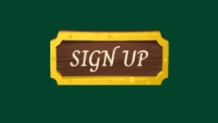
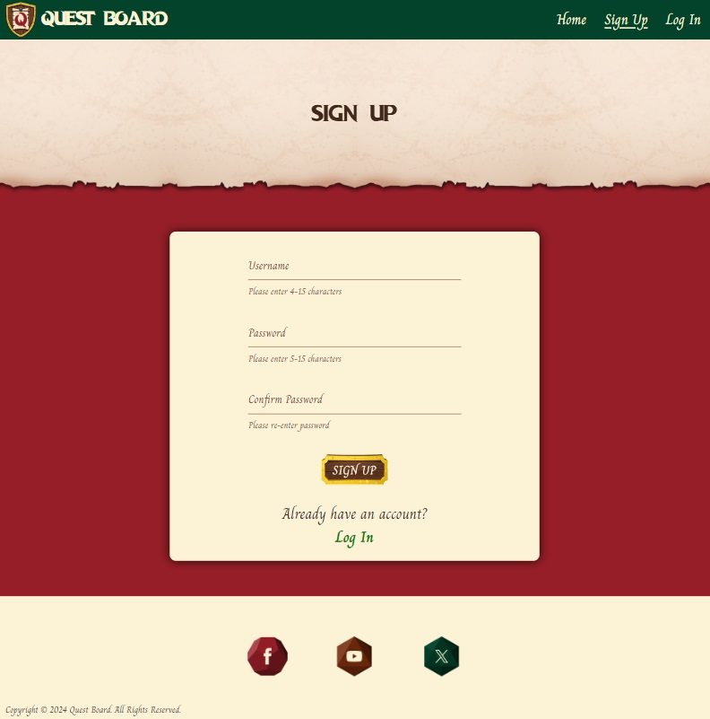

# **Quest Board** <!-- omit in toc -->

## **Welcome to Quest Board: Your Gateway to D&D Adventures in South Wales** <!-- omit in toc -->

Quest Board is more than just a website; it's a thriving community crafted for Dungeons & Dragons enthusiasts in South Wales. Whether you're a seasoned adventurer or a novice seeking your first quest, this is the place to connect with like-minded individuals, create memorable events, and embark on epic journeys together.

So sharpen those pencils, dust off your dice, and prepare for adventure!

This project was created as part of the Code Institute Level 5 Diploma in Web Application Development course.

[Click here to visit Quest Board]()

**By [Andrew Wright](https://github.com/AndyWright360)**

---

## **Contents** <!-- omit in toc --> 

--- 

## **User Experience (UX)**

### **Initial Concept**

The vision behind this project was to develop a website that could foster a community of Dungeons & Dragons players in South Wales. The primary objective was to design a platform that serves as an entry point for newcomers while simultaneously delivering value to more experienced players. To achieve this, the website was crafted with a user-friendly interface, ensuring easy navigation and allowing users to effortlessly create and participate in events.

From a visual perspective, the goal was to theme the website on the fantastical elements of Dungeons & Dragons. The design concept draws from the idea of quests being posted on a message board for adventurers.

### **User Stories**

- **First Time Visitor Goals**

    1. I want to create a profile so that I can start creating and joining events.
    2. I want to filter events based on store location to find events in my preferred area.
    3. I want to view the details of an event to ensure it aligns with my preferences and schedule.

- **Returning Visitor Goals**

    1. I want to log in to my account.
    2. I want to join an event created by another user.
    3. I want to edit the details of an event in case there are changes or updates.

- **Frequent User Goals**

    1. I want to check my profile page so I can easily monitor my created and joined events.
    2. I want to leave an event if my plans change or I can no longer attend.

- **Administrator**

    1. I want to review and moderate user-created events to ensure they comply with community guidelines.

---

## **Design**

### **Colour Scheme**

#### **Primary Palette**

The colour scheme was inspired by the Welsh flag, not only as a nod to the location of the events but also to infuse a sense of regional identity into the platform. This design element aims to enhance the overall sense of community within the South Wales Dungeons & Dragons player base.

#### **Additional Colours**

These additional colours were chosen to complement the primary colour scheme and enhance the visual depth of the website. Light brown was chosen as an alternative font colour, applied to labels for form inputs. Yellow accents were incorporated into various elements to evoke the appearance of golden decorative trim. This colour was also used as the background for Flash messages, ensuring they catch the user's attention. Green was applied to the "sign up" and "log in" links, making them more prominent. The lighter shade of green was employed as an alternative section colour for pages predominantly themed in green.

### **Typography**

#### **Dragon Hunter**

Dragon Hunter was the font used for the headings of the website. The font was chosen to evoke the fantasy theme of the site and establish a thematic connection to Dungeons & Dragons.

#### **Charm**

Charm was used for all other text content throughout the site. This font was chosen for its handwritten style, adding a touch of enchantment to the overall design. To maintain legibility, I implemented a high-contrast colour scheme and increased the font size for enhanced clarity.

### **Imagery**

The central theme guiding the visual design of this website is to capture the fun and approachable essence of Dungeons & Dragons. To embody this, I opted for an animated visual style, incorporating many playful elements throughout the website.

The goal was to integrate the fantastical world of the game into every aspect of the site. Notably, the Google Maps feature was styled to resemble an adventurer's map, and the side navigation bar was crafted to mirror the appearance of a knight's banner.

At the heart of the site's concept was the idea of adventurers receiving quests from a message board. To achieve this, I designed the user created events to resemble sheets of parchment paper. Placing them against a wooden background to evoke the essence of a message board. I aimed to spark the imaginations of the users, encouraging them to take part and become active members of the community. These elements were also incorporated into the logo, for a more cohesive design.

### **Wireframes**

Wireframes were generated using Balsamiq for desktop, tablet, and mobile screen dimensions, ensuring a responsive design. This method aids in visualising and configuring the layout, allowing for a more uniformed user experience across various devices.

#### **Desktop**

Home Page

*Home Page*

Events Page

*Events Page*

Create Event Page

*Create Event Page*

Selected Event Page

*Selected Event Page*

Edit Event Page

*Edit Event Page*

Sign Up Page

*Sign Up Page*

Login Page

*Login Page*

Profile Page

*Profile Page*

#### **Tablet**

Home Page

*Home Page*

Events Page

*Events Page*

Create Event Page

*Create Event Page*

Selected Event Page

*Selected Event Page*

Edit Event Page

*Edit Event Page*

Sign Up Page

*Sign Up Page*

Login Page

*Login Page*

Profile Page

*Profile Page*

#### **Mobile**

Home Page

*Home Page*

Events Page

*Events Page*

Create Event Page

*Create Event Page*

Selected Event Page

*Selected Event Page*

Edit Event Page

*Edit Event Page*

Sign Up Page

*Sign Up Page*

Login Page

*Login Page*

Profile Page

*Profile Page*

---

## **Features**

### **General Features**

#### **Responsive Design**

Screenshots

*Responsive Layout*

- **Responsive:** The layout adjusts to different device widths, providing users with a smooth experience across multiple devices. This improves both accessibility and usability.

#### **Page Heading**

Screenshots

*Page Heading*

*Repeatable Pattern*

- **Heading Design:** The heading of each page was designed to resemble torn parchment paper, aligning with the fantastical design aesthetic.

- **Repeatable Pattern:** The image is seamlessly repeatable, ensuring consistent quality across various screen widths.

#### **Navbar**

Screenshots

*Navbar*

*Navbar - Hover*

*Sidenav*

*Sidenav - Hover*

- **Alternative Colour Scheme:** Implemented a variation between red and green navbars to provide an alternative colour scheme across the site. This variation distinguishes between primary site pages (e.g. home page, events page) and secondary pages (e.g. edit events, sign up).

- **Nav Link Hover Effect:** Applied a hover effect to navbar links to provide users with visual feedback as they select their desired link, enhancing the interactive experience.

- **Sidenav Design:** The sidenav was designed to resemble a medieval banner, aligning with the fantasy adventure visual theme of the website. This design element adds a thematic touch to the navigation experience.

- **Logo Navigation:** The website logo serves as a consistent link to return home, ensuring easy navigation back to the home page from any section of the site. This contributes to a seamless user experience by providing a familiar and intuitive method of navigation.

#### **Flash Messages**

Screenshots

*Flash Message*

- **Flash Messages:** Serve as a means of providing feedback to the user following the execution of an action, communicating the successful completion of the task.

#### **Footer**

Screenshots

*Footer Design*

*Icon Design*

*Icon Hover*

- **Icon Design:** The design of the social media icons was crafted to resemble dice, maintaining thematic consistency across the entire page.

- **Icon Hover Feedback:** Links expand in size when users hover their mouse over them, suggesting interactivity and enhancing user engagement.

#### **Buttons**

Screenshots

*Button Design*

*Button Hover*

*Click Animation*

- **Button Design:** The buttons were fashioned to mirror the appearance of message boards, aligning them thematically with the core design.

- **Mouse Hover Feedback:** Upon mouse hover, the buttons enlarge to offer interactive feedback, enhancing the user experience.

- **Click Animation:** When clicked, the buttons will subtly shrink to simulate the action of being pressed, offering visual feedback to the user.

### **Home Page**

Screenshots

*Home Page*

*Hero Image*

*Our Quest*

*Locations*

*Map*

*Gallery*

*Gallery Auto-Play*

- **Hero Image Design:** The design of the hero image was intended to capture the imaginations of the users. The concept being that the world of the game is being brought to life around the players. The colour palette was adjusted to better suit the theming of the website. A large red dragon is pictured centrally as a nod to the Welsh dragon.

- **Introduction:** The "Our Quest" section serves as a short blurb, summarising the website's purpose for users.

- **Interactive Map Elements:** Partner game store locations are highlighted on the map, each revealing key information upon mouse click.

- **Map Visual Design:** The map was crafted to resemble an adventurer's treasure map, adding a thematic touch to the overall style.

- **Auto-Play Gallery:** The gallery features an auto-play function, scrolling through each image on a timer. The images depict past events, offering users a visual preview of what to anticipate from upcoming gatherings.

### **Sign Up/Login Page**

Screenshots

*Sign Up Page*

*Login Page*

*Input Validation*

*Character Limit*

*Character Counter*

*Required Input Notification*

*Helper Text*

*Input Pattern Recognition*

*Navigation*

- **Visual Feedback:** Utilising Materialize validation classes, input borders change colour to green for valid inputs and red for invalid inputs. Providing users with immediate visual feedback on the validity of their input.

- **Character Limitation:** Implemented a 15-character limitation on input fields, preventing users from exceeding the specified limit and ensuring data integrity.

- **Character Counter:** Integrated Materialize character counter to dynamically display the current character count. Assisting users in staying within the specified character limits.

- **Required Field Indication:** Applied the required attribute to username and password input fields. Prompting users to complete all required inputs before submission and providing notification if incomplete data is detected.

- **Helper Text:** Included helper text to clearly communicate character count requirements, aiding users in understanding input expectations.

- **Pattern Recognition:** Implemented pattern recognition on input fields to ensure the submission of correct data. Notifying users if invalid characters are entered and guiding them to input valid information.

- **Convenient Navigation:** Included links to the login/sign up page on both pages, ensuring easy navigation between pages and enhancing the user experience.

### **Events Page**

Screenshots

*Events Page*

- The events page was crafted to emulate adventurers gathering quests from a message board.

- To enhance this theme, the event container adopts the appearance of a wooden board with metal trim, while the events themselves are represented as paper notes.

- Both the bordered container and wooden slat background are endlessly repeatable, ensuring adaptability to any screen size without distortion or loss of image quality.

- The filter system at the top of the page features a companion downward arrow icon. Signalling to users that additional information is available.

- Upon click, the search categories become visible, aiding users in refining their requirements.

- Multiple options can be selected to provide more tailored search criteria.

- For events created by the current user, edit and delete option buttons are visible.

- Events created by other users will instead display a join button, which changes to "leave" if the user has already joined the event.

- A modal prompts user confirmation to either delete or leave an event, preventing accidental selections that can't be undone.

- Upon hover, each event highlights, serving as a visual cue to users that they are interactive.

- If users without an account attempt to join an event, a message is displayed indicating that a profile is required to perform this action.

- Once the maximum party members have been reached, a "full" stamp will replace the "join" button, signaling to users that the event is at capacity and can no longer be joined.

### **Create Event Page**

Screenshots

*Create Event Page*

- The form on this page incorporates several features aimed at helping users understand the required information and how to address any errors.

- Text inputs with character limits display a character counter, offering users a visual cue on their input progress.

- Helper text accompanies the max-party input, providing clarity regarding the available number range.

- Data error messages are included for text inputs, offering guidance to users in case of invalid entries.

- Required inputs are marked to alert users to any missed fields during submission.

- Input validation is implemented for text and number fields, visually indicating validity with green or invalidity with red cues.

- Popover messages are added to the experience level radio inputs. Offering clear descriptions of each experience level's purpose.

- Images representing different experience levels are color-coded like traffic lights. The intention was to create an intuitive understanding of each level's significance.

### **Future Implementations**

#### **Profile Personalisation**

#### **Party Creation**

#### **Message System**

---
