# **Quest Board - Testing** <!-- omit in toc -->

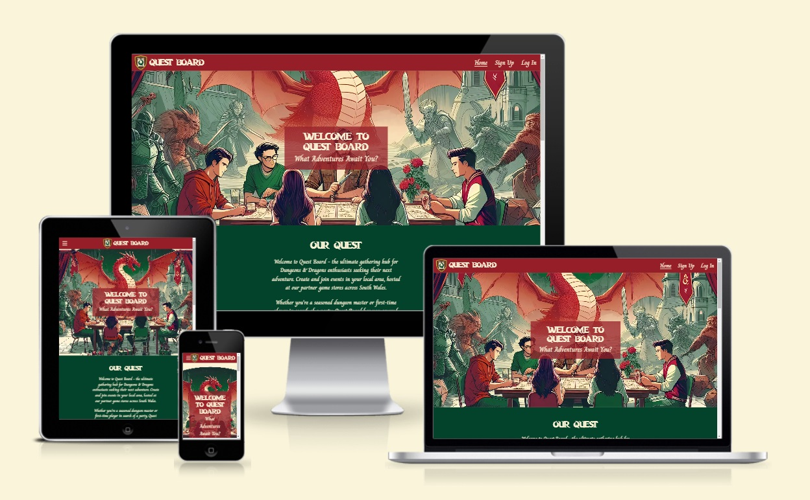

This is the testing documentation for the Quest Board website. [The full README is available here.](README.md)

[Click here to visit Quest Board](https://quest-board-a1869a6a1ddf.herokuapp.com/)

**By [Andrew Wright](https://github.com/AndyWright360)**

---

## **Contents** <!-- omit in toc -->

- [**Automated Testing**](#automated-testing)
  - [**W3C HTML Validation**](#w3c-html-validation)
  - [**W3C CSS Validation**](#w3c-css-validation)
    - [**Second Validation Test**](#second-validation-test)
  - [**JSHint JavaScript Validation**](#jshint-javascript-validation)
  - [**WCAG Colour Contrast Checker**](#wcag-colour-contrast-checker)
    - [**Page Content**](#page-content)
    - [**Score Display**](#score-display)
    - [**Buttons**](#buttons)
    - [**Footer Content**](#footer-content)
  - [**Lighthouse Testing**](#lighthouse-testing)
    - [**Desktop Results**](#desktop-results)
    - [**Mobile Results**](#mobile-results)
- [**Manual Testing**](#manual-testing)
  - [**Testing User Stories**](#testing-user-stories)
    - [**First Time Visitor Goals**](#first-time-visitor-goals)
    - [**Returning Visitor Goals**](#returning-visitor-goals)
    - [**Frequent User Goals**](#frequent-user-goals)
  - [**Full Testing**](#full-testing)

---

## **Automated Testing**

### **W3C HTML Validation**

[W3C](https://validator.w3.org/) was used to validate the HTML code.

| Page | Results |
| :--- | :--- |
| index.html | 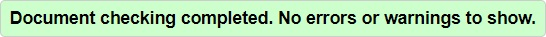 |
| events.html |  |
| event.html |  |
| create_event.html |  |
| edit_event.html |  |
| sign_up.html |  |
| log_in.html |  |
| profile.html |  |
| 400.html |  |
| 403.html |  |
| 404.html |  |
| 500.html |  |

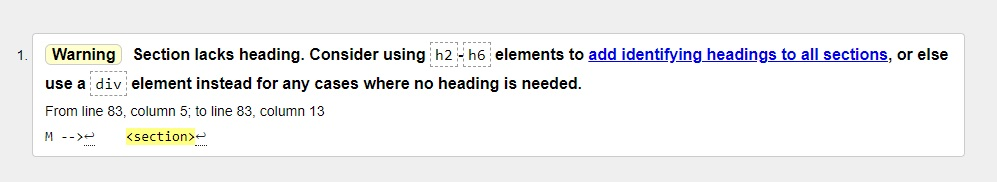

I encountered a warning across multiple pages regarding section elements lacking an associated heading. This issue primarily arose from wrapping flash messages in a section tag, which consequently made them accessible on every page. However, there were also a few instances where sections were used without a heading.

To address this, I refactored the section containers across all pages. Instead of using section tags, I wrapped the flash messages inside div elements. After implementing these changes, all pages passed the validation.

### **W3C CSS Validation**

[W3C](https://jigsaw.w3.org/css-validator/) was used to validate the CSS code.

| Page | Results |
| :--- | :--- |
| style.css | 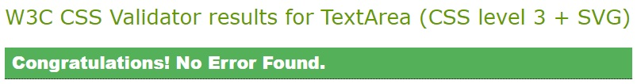 |
| map-style.css |  |

Several warnings were flagged, all related to the use of vendor extensions, which I opted to disregard.

### **JSHint JavaScript Validation**

[JSHint](https://jshint.com/) was used to validate the JavaScript code.

| Page | Results |
| :--- | :--- |
| script.js | 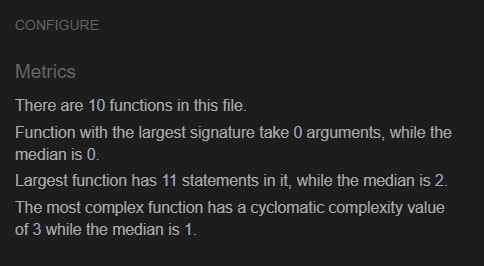 |
| map.js | 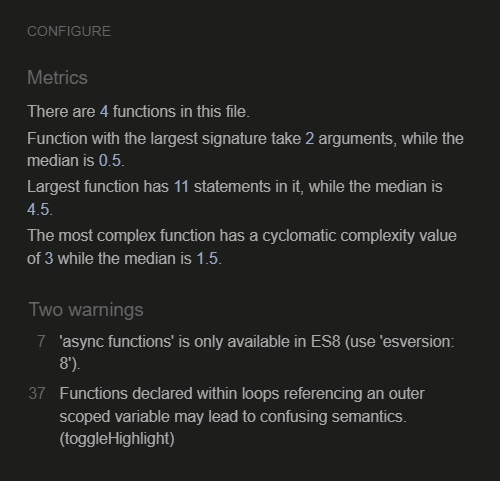 |
| filter.js | 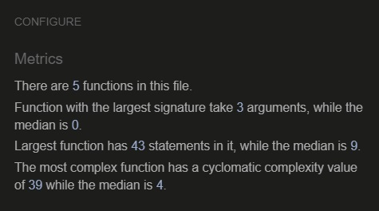 |

Two warnings were found in the map.js file. However, since this code was provided by the documentation for the Google Maps API, I decided to overlook them.

### **Python Validation**

[Code Institute Python Linter](https://pep8ci.herokuapp.com/) was used to validate the Python code.

| Page | Results |
| :--- | :--- |
| app.py | 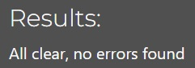 |
| init.py |  |
| models.py |  |
| routes.py |  |

I had to make several corrections to ensure my code complied with PEP8 standards. These corrections primarily involved formatting adjustments, such as reducing the character length of lines and removing unintentional white space. After making the necessary changes, all pages passed without error.

### **WCAG Colour Contrast Checker**

A considerable effort was made in creating a strong contrast in the website's colour scheme. With the font used throughout the site being a handwritten style. I felt it to be vital that the content was clear and as legible as possible to the user. Below, you'll find a detailed breakdown of the outcomes resulting from each combination of background and foreground colours used in this project.

#### **Red & White**

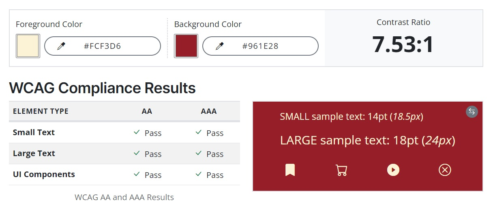

This colour scheme serves as the primary navbar theme across the website. Additionally, it's employed for the "delete" button within user-created events.

#### **Green & White**

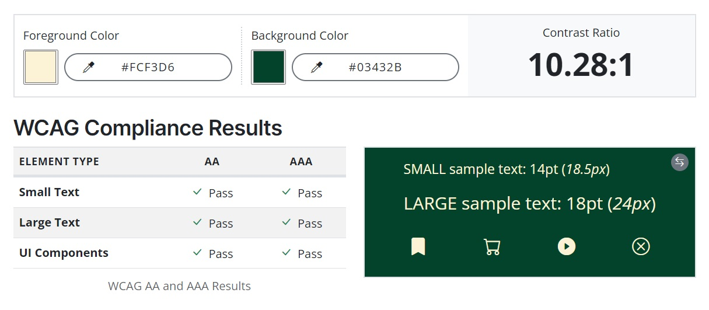

Utilised as the secondary navbar colour, this scheme also extends to page content like the "Our Quest" section on the homepage. Similarly, the "edit" button in user-created events adopts this palette.

#### **Light Green & Brown**

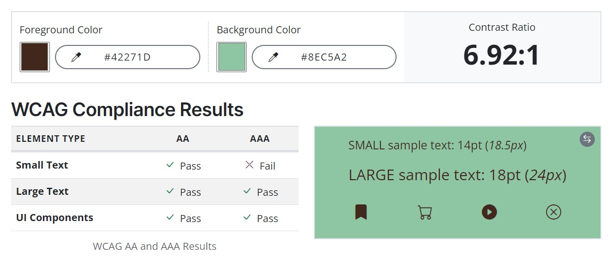

Reserved for section headings on the homepage and profile page, this scheme accompanies large text elements due to its lower contrast.

#### **White & Brown**

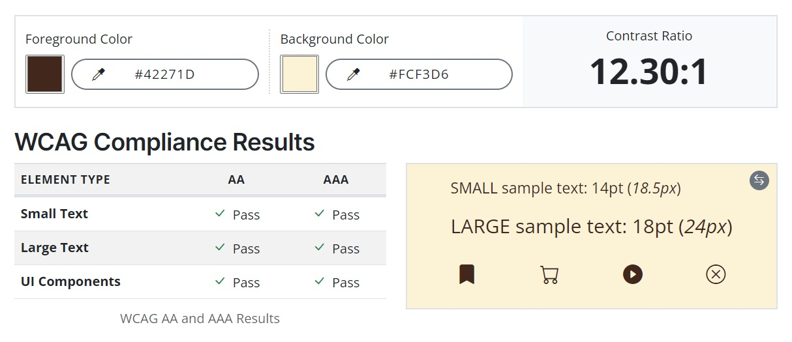

Found primarily in form inputs on the create and edit event pages, as well as in the footer for copyright text.

#### **White & Light Brown**

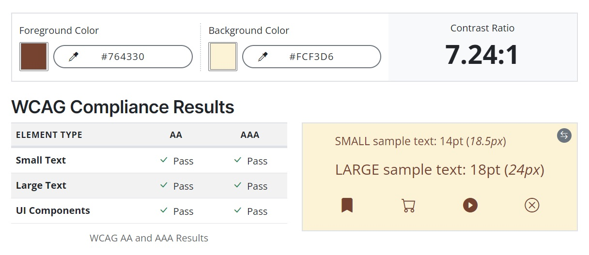
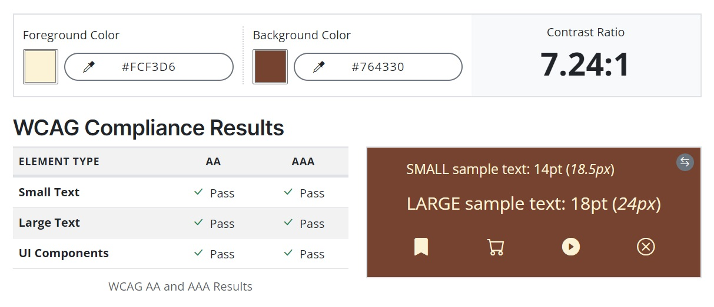

Employed for user input labels and remaining buttons throughout the site.

#### **White & Mid Green**

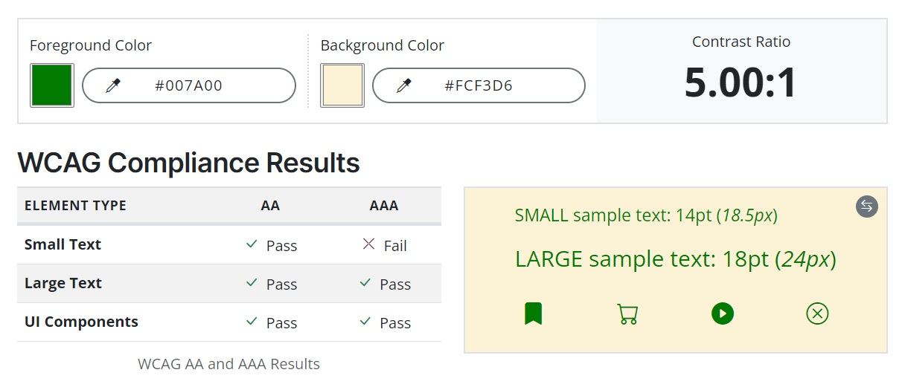

Applied on the "Sign Up" and "Log In" pages, indicating navigation links to alternative pages. The font size was adjusted for clarity due to the lower contrast ratio.

#### **Yellow & Brown**

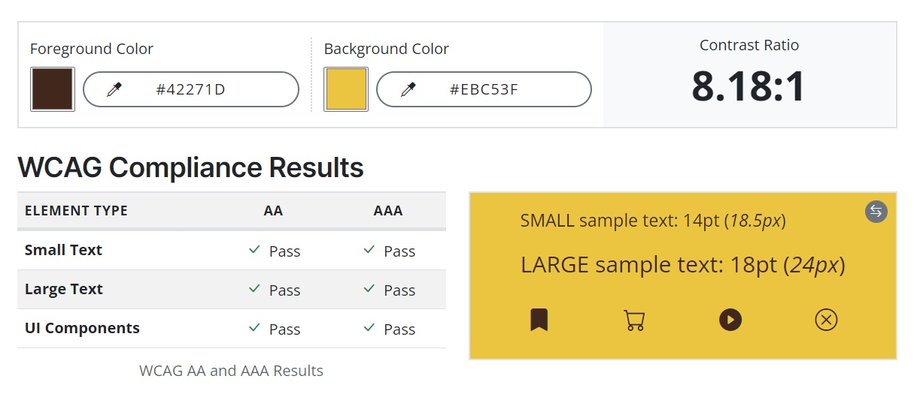

Designed for flash messages, this vibrant scheme ensures important notifications are eye-catching to users.

### **Lighthouse Testing**

Lighthouse within Chrome Developer Tools was used to assess the website's performance, accessibility, adherence to best practices, and SEO.

#### **Desktop Results**

| Page | Results |
| :--- | :--- |
| index.html | 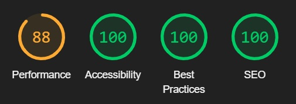 |
| events.html | 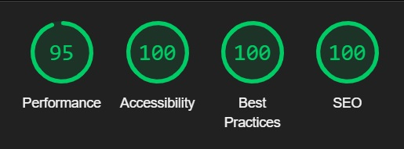 |
| event.html | 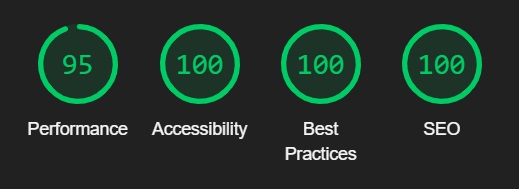 |
| create_event.html | 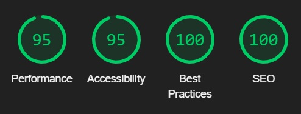 |
| edit_event.html | 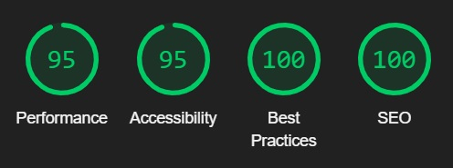 |
| sign_up.html | 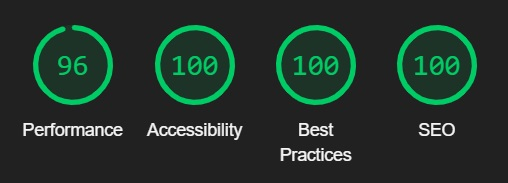 |
| log_in.html | 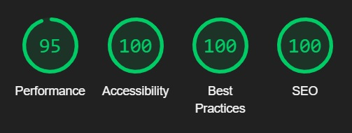 |
| profile.html | 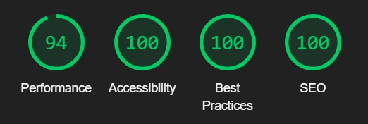 |
| 400.html | 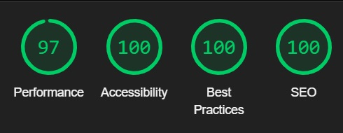 |
| 403.html | 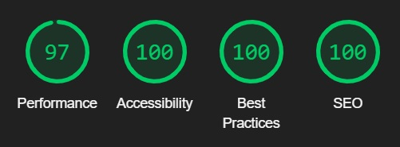 |
| 404.html | 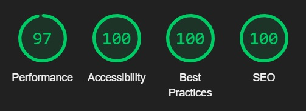 |
| 405.html | 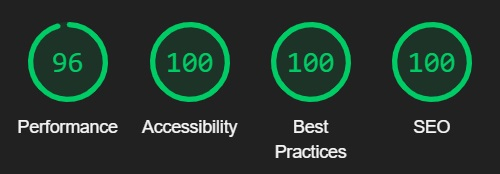 |
| 500.html |  |

#### **Mobile Results**

| Page | Results |
| :--- | :--- |
| index.html | 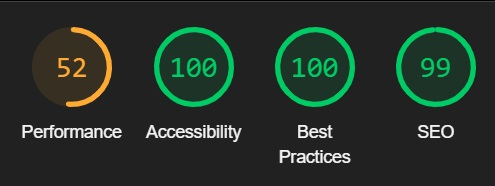 |
| events.html | 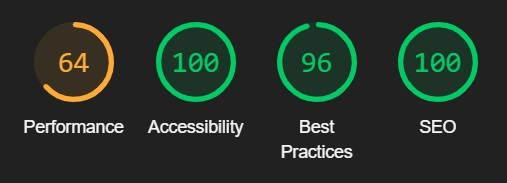 |
| event.html | 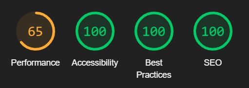 |
| create_event.html | 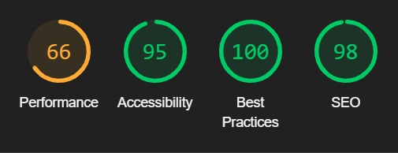 |
| edit_event.html | 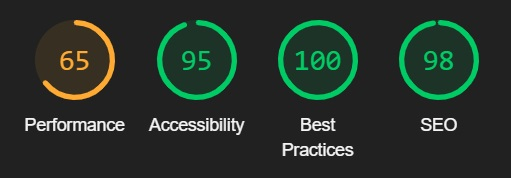 |
| sign_up.html | 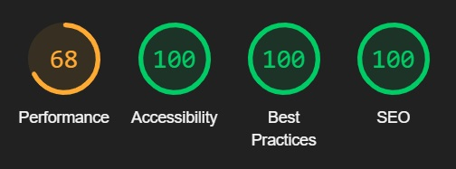 |
| log_in.html | 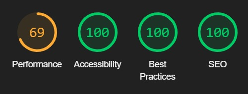 |
| profile.html | 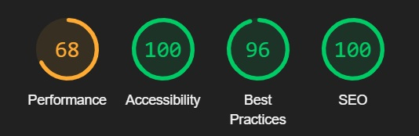 |
| 400.html | 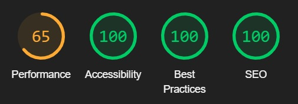 |
| 403.html | 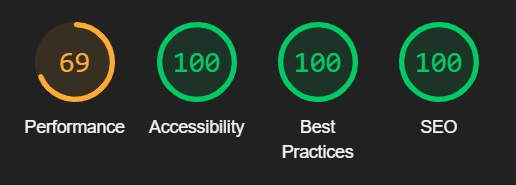 |
| 404.html | 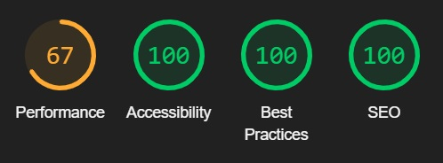 |
| 405.html | 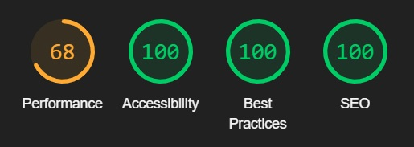 |
| 500.html | 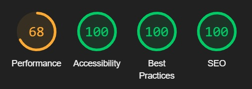 |

---

## **Manual Testing**

### **Testing User Stories**

#### **First Time Visitor Goals**

| Goals | How are they achieved? |
| :--- | :--- |
| I want to create a profile so that I can start creating and joining events. | For users who aren't signed in, a "Sign Up" button is conveniently placed in the "Our Quest" section for easy navigation. Additionally, the sign-up page can be accessed directly from the navbar link. |
| I want to filter events based on store location to find events in my preferred area. | On the events page, a filter option is situated at the top, accompanied by a caret down icon to indicate a dropdown menu. Filter options are categorised, with labelled checkboxes for each selectable search option. Visible events dynamically adjust based on the user's selected search criteria. |
| I want to view the details of an event to ensure it aligns with my preferences and schedule. | A notification is prominently displayed at the top of the events page, providing clear instructions to users on how to reveal further details on events. The colour-coded wax seal stamp, depicting the recommended experience level of the event, serves as a link to the selected event page. The event page offers comprehensive details to the user, including location, time, joined members, and a description of the event. |

#### **Returning Visitor Goals**

| Goals | How are they achieved? |
| :--- | :--- |
| I want to log in to my account. | From the home page, the login link is easily located within the navbar. The login form requests the user's username and password to sign into their profile. Users will remain logged in until manually logging out, provided they return to the website using the same device.. |
| I want to join an event created by another user. | On the events page, all events created by other users will display a "Join" button if open slots are available. Upon selecting, users will be redirected to the event page where their username will appear on the list of joined members. All joined events will be listed on the users profile page. |
| I want to edit the details of an event in case there are changes or updates. | All events created by a user will display an "Edit" button for easy access to modify any details. A collection of all events created by a user will be collated on their profile page for convenient event management. |

#### **Frequent User Goals**

| Goals | How are they achieved? |
| :--- | :--- |
| I want to check my profile page so I can easily monitor my created and joined events. | Upon logging in to their account, users will be redirected to their profile page. This page can also be accessed from the navbar link when a user is logged in. The profile page displays all events created by the user and separately lists any events they have joined. This provides a single page where all events associated with the user can be managed. |
| I want to leave an event if my plans change or I can no longer attend. | Events that have been joined by a user will display a "Leave" button. Upon selecting, the user will be redirected to the corresponding event page where their username will be removed from the list of joined participants. A notification message will confirm that the user has successfully left the event. |
| I want to delete a created event. | All events created by a user will display a "Delete" button. Upon selection, a modal will appear requesting confirmation of the deletion. Once confirmed, a message will notify the user that the event was deleted successfully. |

#### **Administrator**

| Goals | How are they achieved? |
| :--- | :--- |
| I want to review and moderate user-created events to ensure they comply with community guidelines. | As an admin, all events created by users can be editted or deleted. This allows details to be easily modified if required. |

### **Full Testing**

Full testing was performed on the following devices:

- Laptop:
  - MSI Thin GF63 15 inch screen
- Mobile Device:
  - iPhone XR

The following browsers were tested using each device:

- Laptop:
  - Google Chrome
  - Mozilla Firefox
- Mobile:
  - Safari

Friends and family also tested the website using a variety of devices. No issues were reported.

Feature | Expected Outcome | Testing Performed | Result | Pass/Fail |
| --- | --- | --- | --- | --- |
| `Navbar` |
| Page Title | Redirect to the home page | Click page title | Redirected to home page | Pass |
| Home Link | Redirect to the home page | Click link | Redirected to home page | Pass |
| Events Link | Redirect to the events page | Click link | Redirected to events page | Pass |
| Sign Up Link | Redirect to the sign up page | Click link | Redirected to sign up page | Pass |
| Login Link | Redirect to the login page | Click link | Redirected to login page | Pass |
| Profile Link | Redirect to the profile page | Click link | Redirected to profile page | Pass |
| Log Out Link | Logs user out | Click link | User logged out | Pass |
| Burger Menu | Opens sidenav | Click icon | Sidenav opens | Pass |
| `Sidenav` |
| Home Link | Redirect to the home page | Click link | Redirected to home page | Pass |
| Events Link | Redirect to the events page | Click link | Redirected to events page | Pass |
| Sign Up Link | Redirect to the sign up page | Click link | Redirected to sign up page | Pass |
| Login Link | Redirect to the login page | Click link | Redirected to login page | Pass |
| Profile Link | Redirect to the profile page | Click link | Redirected to profile page | Pass |
| Log Out Link | Logs user out | Click link | User logged out | Pass |
| Close Sidenav | Close the sidenav bar | Click outside sidenav | Sidenav closed | Pass |
| `Footer` |
| Social Media Link (Facebook) | Opens Facebook link in a new tab | Clicked Facebook icon | New tab opened to Facebook | Pass |
| Social Media Link (YouTube) | Opens YouTube link in a new tab | Clicked YouTube icon | New tab opened to YouTube | Pass |
| Social Media Link (Twitter) | Opens Twitter link in a new tab | Clicked Twitter icon | New tab opened to Twitter | Pass |
| Icon Hover Effect | Icon size increases on mouse hover | Hover mouse over icon | Icon size increases | Pass |
| `Home Page` |
| Button Hover Effect | Button scale increase on mouse hover | Hover mouse over button | Button scale increases | Pass |
| Button Click Animation | Button scale decreases on click | Click button | Button scale decreases | Pass |
| Sign Up Button | Redirect to the sign up page | Click button | Redirected to sign up page | Pass |
| Open Map Marker (Checkmates) | Display store information window | Click marker | Store information window displayed | Pass |
| Close Map Marker (Checkmates) | Close store information window | Click information widow | Store information window closed | Pass |
| Open Map Marker (Dungeons & Dice) | Display store information window | Click marker | Store information window displayed | Pass |
| Close Map Marker (Dungeons & Dice) | Close store information window | Click information widow | Store information window closed | Pass |
| Open Map Marker (Castle Games) | Display store information window | Click marker | Store information window displayed | Pass |
| Close Map Marker (Castle Games) | Close store information window | Click information widow | Store information window closed | Pass |
| Open Map Marker (Boarderlands) | Display store information window | Click marker | Store information window displayed | Pass |
| Close Map Marker (Boarderlands) | Close store information window | Click information widow | Store information window closed | Pass |
| Display Next Gallery Image | Next sequential gallery image displays on screen | Drag gallery image to the left | Next gallery image displayed | Pass |
| Display Previous Gallery Image | Previous gallery image displays on screen | Drag gallery image to the right | Previous gallery image displayed | Pass |
| Select Gallery Indicator | Display the selected gallery image | Click gallery indicator | Selected gallery image displayed | Pass |
| `Events Page` |
| Prevent logged out users from accessing the page | Users who aren't logged in will recieve a flash message and be redirected to the log in page. | Access the page via the url link whilst logged out | Redirected to log in page and flash message displayed | Pass |
| Fliter Dropdown (Open) | Open filter dropdown to display search options | Click filter | Filter dropdown opens | Pass |
| Fliter Dropdown (Close) | Close filter dropdown to remove search options | Click filter | Filter dropdown closes | Pass |
| Filter Checkbox (Cardiff) | Display events matching selected option | Click checkbox | Display corresponding events | Pass |
| Filter Checkbox (Newport) | Display events matching selected option | Click checkbox | Display corresponding events | Pass |
| Filter Checkbox (Swansea) | Display events matching selected option | Click checkbox | Display corresponding events | Pass |
| Filter Checkbox (Bridgend) | Display events matching selected option | Click checkbox | Display corresponding events | Pass |
| Filter Checkbox (10am) | Display events matching selected option | Click checkbox | Display corresponding events | Pass |
| Filter Checkbox (12pm) | Display events matching selected option | Click checkbox | Display corresponding events | Pass |
| Filter Checkbox (2pm) | Display events matching selected option | Click checkbox | Display corresponding events | Pass |
| Filter Checkbox (4pm) | Display events matching selected option | Click checkbox | Display corresponding events | Pass |
| Filter Checkbox (Beginner) | Display events matching selected option | Click checkbox | Display corresponding events | Pass |
| Filter Checkbox (Everyone) | Display events matching selected option | Click checkbox | Display corresponding events | Pass |
| Filter Checkbox (Experienced) | Display events matching selected option | Click checkbox | Display corresponding events | Pass |
| Button Hover Effect | Button scale increase on mouse hover | Hover mouse over button | Button scale increases | Pass |
| Button Click Animation | Button scale decreases on click | Click button | Button scale decreases | Pass |
| Create Event Button | Redirect to the create event page | Click button | Redirected to create event page | Pass |
| Edit Button | Redirect to the edit event page | Click button | Redirected to edit event page | Pass |
| Delete Button | Open delete event modal | Click button | Delete event modal opened | Pass |
| Join Button | Increase party member display by one | Click button | Party member display increased by one | Pass |
| Leave Button | Decrease party member display by one | Click button | Party member display decreased by one | Pass |
| Full Event | Display "Full" stamp when party list reaches capacity | Fill party list | "Full" stamp displays on event | Pass |
| Event Stamp | Redirect to the selected event page | Click stamp | Redirected to selected event page | Pass |
| Unathorised Deletion | Redirect to 403 error page and display flash message | Attempt to delete other users event via the url link | Redirected to 403 error page and flash message displayed | Pass |
| Unathorised Edit | Redirect to 403 error page and display flash message | Attempt to edit other users event via the url link | Redirected to 403 error page and flash message displayed | Pass |
| Logged Out Deletion | Redirect to log in page and display flash message | Attempt to delete event via the url link while logged out | Redirected to log in page and flash message displayed | Pass |
| Logged Out Edit | Redirect to log in page and display flash message | Attempt to edit event via the url link while logged out | Redirected to log in page and flash message displayed | Pass |
| GET Method Join | Redirect to 405 error page and display flash message | Attempt to join event via the url link | Redirected to 405 error page and flash message displayed | Pass |
| GET Method Leave | Redirect to 405 error page and display flash message | Attempt to leave event via the url link | Redirected to 405 error page and flash message displayed | Pass |
| Join Full Event | Redirect to events page and display flash message | Attempt to join an event that's full | Redirected to events page and flash message displayed | Pass |
| `Event Page` |
| Prevent logged out users from accessing the page | Users who aren't logged in will recieve a flash message and be redirected to the log in page. | Access the page via the url link whilst logged out | Redirected to log in page and flash message displayed | Pass |
| Button Hover Effect | Button scale increase on mouse hover | Hover mouse over button | Button scale increases | Pass |
| Button Click Animation | Button scale decreases on click | Click button | Button scale decreases | Pass |
| Edit Button | Redirect to the edit event page | Click button | Redirected to edit event page | Pass |
| Delete Button | Open delete event modal | Click button | Delete event modal opened | Pass |
| Join Button | Add username to party member list | Click button | Username added to party list | Pass |
| Leave Button | Remove username from party member list | Click button | Username removed from party list | Pass |
| Full Event | Display "Full" stamp when party list reaches capacity | Fill party list | "Full" stamp displays on event | Pass |
| `Create Event Page` |
| Prevent logged out users from accessing the page | Users who aren't logged in will recieve a flash message and be redirected to the log in page. | Access the page via the url link whilst logged out | Redirected to log in page and flash message displayed | Pass |
| Character Counter (Username) | Dynamically display character number as input is entered | Enter input data | Counter displays current character number | Pass |
| Character Counter (Description) | Dynamically display character number as input is entered | Enter input data | Counter displays current character number | Pass |
| Select Dropdown (Location) | Display list of location options | Click input | Displays list of location options | Pass |
| Select Dropdown (Time) | Display list of time options | Click input | Displays list of time options | Pass |
| Date Picker | Open date picker modal | Click date input | Date picker modal opens | Pass |
| Required Input (Event Name) | Display message to user for unfilled input field | Submit form with empty inputs | Message displayed notifying of empty input field | Pass |
| Required Input (Location) | Display message to user for unfilled input field | Submit form with empty inputs | Message displayed notifying of empty input field | Pass |
| Required Input (Time) | Display message to user for unfilled input field | Submit form with empty inputs | Message displayed notifying of empty input field | Pass |
| Required Input (Date) | Display message to user for unfilled input field | Submit form with empty inputs | Message displayed notifying of empty input field | Pass |
| Required Input (Max Party Size) | Display message to user for unfilled input field | Submit form with empty inputs | Message displayed notifying of empty input field | Pass |
| Required Input (Description) | Display message to user for unfilled input field | Submit form with empty inputs | Message displayed notifying of empty input field | Pass |
| Radio Input (Beginner) | Radio button highligted when input selected | Select input | Radio button highlighted | Pass |
| Radio Input (Everyone) | Radio button highligted when input selected | Select input | Radio button highlighted | Pass |
| Radio Input (Experienced) | Radio button highligted when input selected | Select input | Radio button highlighted | Pass |
| Popover Message (Beginner) | Display popover message when hovering over question mark icon | Hover over icon | Corresponding popover message displayed | Pass |
| Popover Message (Experienced) | Display popover message when hovering over question mark icon | Hover over icon | Corresponding popover message displayed | Pass |
| Popover Message (Experienced) | Display popover message when hovering over question mark icon | Hover over icon | Corresponding popover message displayed | Pass |
| Event Name Validation (Spaces Only) | Reload page and display flash message | Input form with spaces only as Event Name input | Page reloaded and relevant message displayed | Pass |
| Event Name Validation (Start with Space) | Reload page and display flash message | Input form with space at start of Event Name input | Page reloaded and relevant message displayed | Pass |
| Event Name Validation (End with Space) | Reload page and display flash message | Input form with space at end of Event Name input | Page reloaded and relevant message displayed | Pass |
| Date Validation (Can't be a past date) | Reload page and display flash message | Input form with past date as input | Page reloaded and relevant message displayed | Pass |
| Description Validation (Spaces Only) | Reload page and display flash message | Input form with spaces only as Description input | Page reloaded and relevant message displayed | Pass |
| Description Validation (Start with Space) | Reload page and display flash message | Input form with space at start of Description input | Page reloaded and relevant message displayed | Pass |
| Description Validation (End with Space) | Reload page and display flash message | Input form with space at end of Description input | Page reloaded and relevant message displayed | Pass |
| Event Created Successfully | Redirect to events page and display flash message | Submit form with valid inputs | Redirected to events page and relevant message displayed | Pass |
| `Edit Event Page` |
| Prevent logged out users from accessing the page | Users who aren't logged in will recieve a flash message and be redirected to the log in page. | Access the page via the url link whilst logged out | Redirected to log in page and flash message displayed | Pass |
| Character Counter (Username) | Dynamically display character number as input is entered | Enter input data | Counter displays current character number | Pass |
| Character Counter (Description) | Dynamically display character number as input is entered | Enter input data | Counter displays current character number | Pass |
| Select Dropdown (Location) | Display list of location options | Click input | Displays list of location options | Pass |
| Select Dropdown (Time) | Display list of time options | Click input | Displays list of time options | Pass |
| Date Picker | Open date picker modal | Click date input | Date picker modal opens | Pass |
| Required Input (Event Name) | Display message to user for unfilled input field | Submit form with empty inputs | Message displayed notifying of empty input field | Pass |
| Required Input (Date) | Display message to user for unfilled input field | Submit form with empty inputs | Message displayed notifying of empty input field | Pass |
| Required Input (Max Party Size) | Display message to user for unfilled input field | Submit form with empty inputs | Message displayed notifying of empty input field | Pass |
| Required Input (Description) | Display message to user for unfilled input field | Submit form with empty inputs | Message displayed notifying of empty input field | Pass |
| Radio Input (Beginner) | Radio button highligted when input selected | Select input | Radio button highlighted | Pass |
| Radio Input (Everyone) | Radio button highligted when input selected | Select input | Radio button highlighted | Pass |
| Radio Input (Experienced) | Radio button highligted when input selected | Select input | Radio button highlighted | Pass |
| Popover Message (Beginner) | Display popover message when hovering over question mark icon | Hover over icon | Corresponding popover message displayed | Pass |
| Popover Message (Experienced) | Display popover message when hovering over question mark icon | Hover over icon | Corresponding popover message displayed | Pass |
| Popover Message (Experienced) | Display popover message when hovering over question mark icon | Hover over icon | Corresponding popover message displayed | Pass |
| Event Name Validation (Spaces Only) | Reload page and display flash message | Input form with spaces only as Event Name input | Page reloaded and relevant message displayed | Pass |
| Event Name Validation (Start with Space) | Reload page and display flash message | Input form with space at start of Event Name input | Page reloaded and relevant message displayed | Pass |
| Event Name Validation (End with Space) | Reload page and display flash message | Input form with space at end of Event Name input | Page reloaded and relevant message displayed | Pass |
| Date Validation (Can't be a past date) | Reload page and display flash message | Input form with past date as input | Page reloaded and relevant message displayed | Pass |
| Description Validation (Spaces Only) | Reload page and display flash message | Input form with spaces only as Description input | Page reloaded and relevant message displayed | Pass |
| Description Validation (Start with Space) | Reload page and display flash message | Input form with space at start of Description input | Page reloaded and relevant message displayed | Pass |
| Description Validation (End with Space) | Reload page and display flash message | Input form with space at end of Description input | Page reloaded and relevant message displayed | Pass |
| Reduce Party Size Below Joined Members | Reload page and display flash message | Reduce the Max Party Size input below the number of joined members | Page reloaded and relevant message displayed | Pass |
| Event Editted Successfully | Redirect to events page and display flash message | Submit form with valid inputs | Redirected to events page and relevant message displayed | Pass |
| `Delete Event Modal` |
| Button Hover Effect | Button colour darkens on mouse hover | Hover mouse over button | Button colour darkens | Pass |
| Cancel Button | Close delete modal | Click button | Modal closed | Pass |
| Delete Button | Delete event data and redirect to events page | Click button | Redirected to events page and event deleted | Pass |
| Close Modal (Click outside modal window) | Close modal by clicking outside window | Click outside modal window | Modal closed | Pass |
| `Sign Up Page` |
| Prevent logged in users from accessing the page | Users who are logged in will recieve a flash message and be redirected to their profile page. | Access the page via the url link whilst logged in | Redirected to profile page and flash message displayed | Pass |
| Valid Input (Username) | Input border turns green and displays "valid" text | Enter valid input | Input border turned green and displayed "valid" text | Pass |
| Invalid Input (Username) | Input border turns red and displays "invalid entry" text | Enter invalid input | Input border turned red and displayed "invalid entry" text | Pass |
| Valid Input (Password) | Input border turns green and displays "valid" text | Enter valid input | Input border turned green and displayed "valid" text | Pass |
| Invalid Input (Password) | Input border turns red and displays "invalid entry" text | Enter invalid input | Input border turned red and displayed "invalid entry" text | Pass |
| Valid Input (Confirm Password) | Input border turns green and displays "valid" text | Enter valid input | Input border turned green and displayed "valid" text | Pass |
| Invalid Input (Confirm Password) | Input border turns red and displays "invalid entry" text | Enter invalid input | Input border turned red and displayed "invalid entry" text | Pass |
| Character Counter (Username) | Dynamically display character number as input is entered | Enter input data | Counter displays current character number | Pass |
| Character Counter (Password) | Dynamically display character number as input is entered | Enter input data | Counter displays current character number | Pass |
| Character Counter (Confirm Password) | Dynamically display character number as input is entered | Enter input data | Counter displays current character number | Pass |
| Required Input (Username) | Display message to user for unfilled input field | Submit form with empty inputs | Message displayed notifying of empty input field | Pass |
| Required Input (Password) | Display message to user for unfilled input field | Submit form with empty inputs | Message displayed notifying of empty input field | Pass |
| Required Input (Confirm Password) | Display message to user for unfilled input field | Submit form with empty inputs | Message displayed notifying of empty input field | Pass |
| Input Pattern Recognition | Display message to user if keys outside the pattern requirements are entered | Submit form with invalid inputs | Message displayed notifying of incorrect input type | Pass |
| Check Passwords Match | Reload page and display message if passwords don't match | Submit form with unmatched password inputs | Page reloaded and flash message displayed | Pass |
| Check Username Exists | Reload page and display message if username exisits | Submit form with exisiting username | Page reloaded and flash message displayed | Pass |
| Link Hover Effect | Text underlines on mouse hover | Hover over link text | Link text underlined | Pass |
| Log In Link | Redirect to login page | Click button | Redirected to login page | Pass |
| Successful Sign Up | Redirect to profile page | Submit valid sign up details | Redirected to profile page | Pass |
| `Login Page` |
| Prevent logged in users from accessing the page | Users who are logged in will recieve a flash message and be redirected to their profile page. | Access the page via the url link whilst logged in | Redirected to profile page and flash message displayed | Pass |
| Valid Input (Username) | Input border turns green and displays "valid" text | Enter valid input | Input border turned green and displayed "valid" text | Pass |
| Invalid Input (Username) | Input border turns red and displays "invalid entry" text | Enter invalid input | Input border turned red and displayed "invalid entry" text | Pass |
| Valid Input (Password) | Input border turns green and displays "valid" text | Enter valid input | Input border turned green and displayed "valid" text | Pass |
| Invalid Input (Password) | Input border turns red and displays "invalid entry" text | Enter invalid input | Input border turned red and displayed "invalid entry" text | Pass |
| Character Counter (Username) | Dynamically display character number as input is entered | Enter input data | Counter displays current character number | Pass |
| Character Counter (Password) | Dynamically display character number as input is entered | Enter input data | Counter displays current character number | Pass |
| Required Input (Username) | Display message to user for unfilled input field | Submit form with empty inputs | Message displayed notifying of empty input field | Pass |
| Required Input (Password) | Display message to user for unfilled input field | Submit form with empty inputs | Message displayed notifying of empty input field | Pass |
| Input Pattern Recognition | Display message to user if keys outside the pattern requirements are entered | Submit form with invalid inputs | Message displayed notifying of incorrect input type | Pass |
| Link Hover Effect | Text underlines on mouse hover | Hover over link text | Link text underlined | Pass |
| Sign Up Link | Redirect to sign up page | Click button | Redirected to sign up page | Pass |
| Invalid Username | Display message notifying of invalid username or password | Submit incorrect username | Message displayed notifying of invalid username or password | Pass |
| Invalid Password | Display message notifying of invalid username or password | Submit incorrect password | Message displayed notifying of invalid username or password | Pass |
| Successful Login | Redirect to profile page | Submit valid login details | Redirected to profile page | Pass |
| `Profile Page` |
| Prevent logged out users from accessing the page | Users who aren't logged in will recieve a flash message and be redirected to the log in page. | Access the page via the url link whilst logged out | Redirected to log in page and flash message displayed | - |
| Button Hover Effect | Button scale increase on mouse hover | Hover mouse over button | Button scale increases | - |
| Button Click Animation | Button scale decreases on click | Click button | Button scale decreases | - |
| Create Event Button | Redirect to the create event page | Click button | Redirected to create event page | - |
| Edit Button | Redirect to the edit event page | Click button | Redirected to edit event page | - |
| Delete Button | Open delete event modal | Click button | Delete event modal opened | - |
| Leave Button | Remove event from joined event list | Click button | Event removed from joined events list | - |
| Event Stamp | Redirect to the selected event page | Click stamp | Redirected to selected event page | - |
| No Events Message | Display message if no created events exist | Enter page with no created events | Message displayed notifying of no events | - |
| No Joined Events Message | Display message if no joined events exist | Enter page with no joined events | Message displayed notifying of no joined events | - |
| `400 Error Page` |
| Return Home Button | Redirect to the home page | Click button | Redirected to home page | - |
| Button Hover Effect | Button scale increase on mouse hover | Hover mouse over button | Button scale increases | - |
| Button Click Animation | Button scale decreases on click | Click button | Button scale decreases | - |
| `403 Error Page` |
| Return Home Button | Redirect to the home page | Click button | Redirected to home page | - |
| Button Hover Effect | Button scale increase on mouse hover | Hover mouse over button | Button scale increases | - |
| Button Click Animation | Button scale decreases on click | Click button | Button scale decreases | - |
| `404 Error Page` |
| Return Home Button | Redirect to the home page | Click button | Redirected to home page | - |
| Button Hover Effect | Button scale increase on mouse hover | Hover mouse over button | Button scale increases | - |
| Button Click Animation | Button scale decreases on click | Click button | Button scale decreases | - |
| `405 Error Page` |
| Return Home Button | Redirect to the home page | Click button | Redirected to home page | - |
| Button Hover Effect | Button scale increase on mouse hover | Hover mouse over button | Button scale increases | - |
| Button Click Animation | Button scale decreases on click | Click button | Button scale decreases | - |
| `500 Error Page` |
| Return Home Button | Redirect to the home page | Click button | Redirected to home page | - |
| Button Hover Effect | Button scale increase on mouse hover | Hover mouse over button | Button scale increases | - |
| Button Click Animation | Button scale decreases on click | Click button | Button scale decreases | - |

### **Bugs & Fixes**

#### **Button Scale Bug**

I noticed that the text within buttons moved as the scale increased on mouse hover. Upon searching online I was able to find a resolution on Stack Overflow contributed by Chris W (please see credits section below). The fix incorporated additional CSS classes to create a seamless transition during scaling.

#### **Horizontal Scroll Bug**

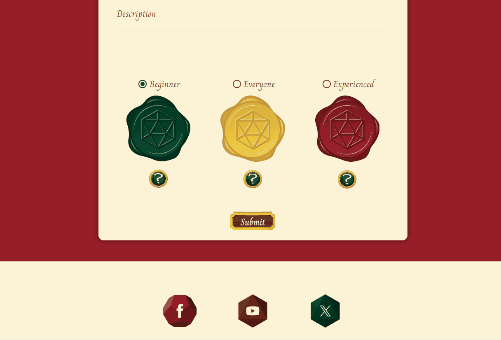

After including the popover messages to the Create Event page, I encountered this bug. After the size of the page window had been reduced, the width of the body exceeded the display width, creating horizontal page scroll. This occurred even though no content on the page was being pushed outside the display. 

As far as I could tell, the page wasn't resizing the popover content correctly. Upon reloading the page, the horizontal scroll would disappear. The fix I implemented to was to apply `overflow-x: hidden` to the body element.

#### **Navbar Link Bug**

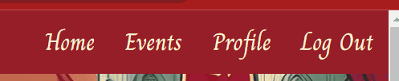

This issue occurred after I changed the "id" attribute to a "class" attribute for the board trim on the events page. The reason behind this change was to address a situation where both sets of boards were being displayed simultaneously on the profile page. Instead of using unique IDs to target each side of the trim and corner plates, I opted for class names. However, one of these class names inadvertently matched a Materialize class associated with navbar links. Consequently, the CSS styling intended for the board trim was also affecting the position of the navbar links. To resolve this, I assigned alternative class names to the board trim and corner plates.

#### **Materialize Select Validation Bug**

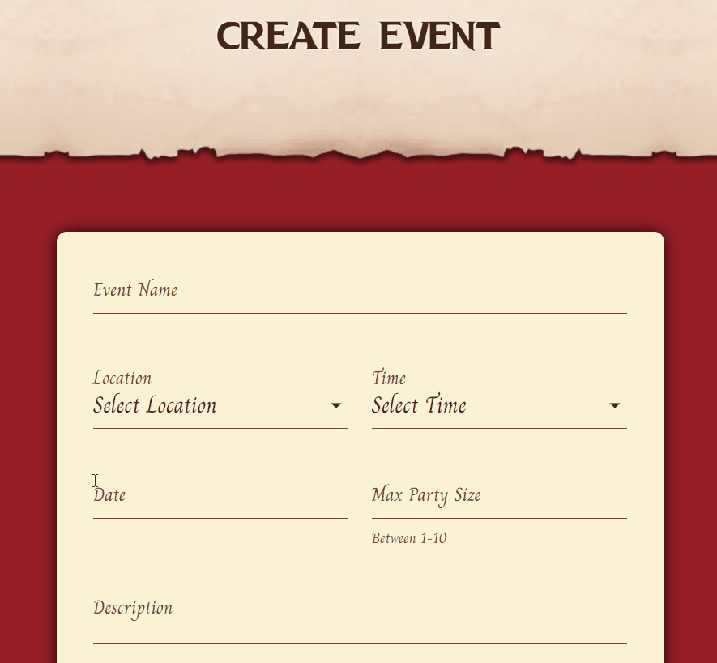

This bug involved the use of JavaScript to replicate the Materialize validate class for form inputs. This class provides visual feedback to the user for valid and invalid inputs by dynamically altering the colour of the input border. The bug resulted in the border colour changing to red whenever the input lost focus, regardless of its validity. This only affected the select inputs on the create event page and functioned as intended on the edit event page. I also tested this on multiple devices and found it only to be present on my laptop, despite the same browser being used on other tests.

As I was unable to find a method to add the validate class to the date and textarea inputs. I opted to remove this class from the event form inputs altogether. As this validation method wasn't consistent across all inputs on the form, I felt it wasn't offering the user experience I intended. And with no known fix for the bug, I wanted to avoid the possibility of users being provided incorrect feedback.

#### **Materialize Select Input Mobile Bug**

I encountered this issue while testing the site on an iPhone. The Materialize select dropdown menu doesn't function effectively on touchscreen devices. Often, the input would populate with a different option than the one selected, resulting in a frustrating user experience as it becomes challenging to select the intended option.

Upon researching online, I discovered that this issue is widely documented and found a solution on Stack Overflow.

### **Known Bugs**

#### **Section Pixel Bug**

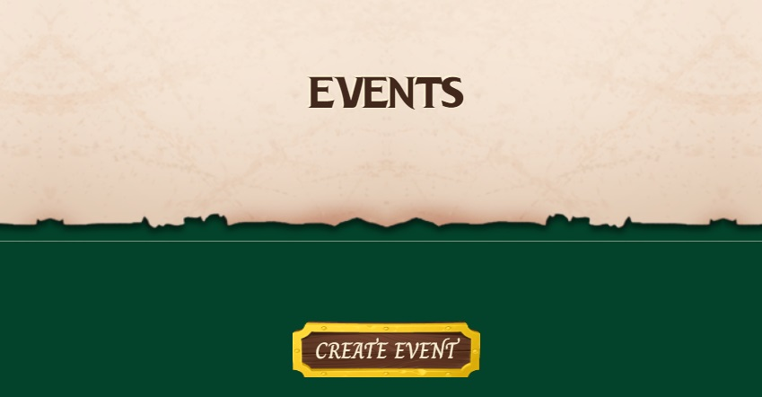

Despite thorough research, I couldn't find a definitive solution to this issue. It occurs when two sections with the same background color connect, resulting in occasional misalignment and a 1 or 2-pixel white line gap between them. The size of this gap varies based on the width of the display screen. To mitigate this, I adjusted the height of the header section, which removed it from the range of display widths that the site can be viewed. However, I'm unsure if this would fix the issue across all browsers.

#### Select Required Mobile Bug

<video controls height="550">
  <source src="documentation/testing/select-required-mobile-bug.mp4" type="video/mp4">
  Your browser does not support the video tag.
</video>

While testing my website on mobile devices, I encountered a bug related to the required attribute in select inputs. Although the required attribute successfully prevents users from submitting the form if a select option hasn't been chosen, it fails to provide the necessary feedback message to alert users of the issue. Despite efforts to identify the cause, I have been unable to find a solution for this issue.