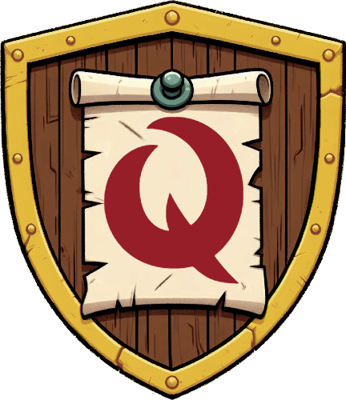

# **Quest Board - Testing** <!-- omit in toc -->

This is the testing documentation for the Quest Board website. [The full README is available here.](README.md)

[Click here to visit Quest Board]()

**By [Andrew Wright](https://github.com/AndyWright360)**

---

## **Contents** <!-- omit in toc -->

- [**Automated Testing**](#automated-testing)
  - [**W3C HTML Validation**](#w3c-html-validation)
  - [**W3C CSS Validation**](#w3c-css-validation)
    - [**Second Validation Test**](#second-validation-test)
  - [**JSHint JavaScript Validation**](#jshint-javascript-validation)
  - [**WCAG Colour Contrast Checker**](#wcag-colour-contrast-checker)
    - [**Page Content**](#page-content)
    - [**Score Display**](#score-display)
    - [**Buttons**](#buttons)
    - [**Footer Content**](#footer-content)
  - [**Lighthouse Testing**](#lighthouse-testing)
    - [**Desktop Results**](#desktop-results)
    - [**Mobile Results**](#mobile-results)
- [**Manual Testing**](#manual-testing)
  - [**Testing User Stories**](#testing-user-stories)
    - [**First Time Visitor Goals**](#first-time-visitor-goals)
    - [**Returning Visitor Goals**](#returning-visitor-goals)
    - [**Frequent User Goals**](#frequent-user-goals)
  - [**Full Testing**](#full-testing)

---

## **Automated Testing**

### **W3C HTML Validation**

[W3C](https://validator.w3.org/) was used to validate the HTML code.

- index.html - RESULT
- events.html - RESULT
- event.html - RESULT
- create_event.html - RESULT
- edit_event.html - RESULT
- sign_up.html - RESULT
- log_in.html - RESULT
- profile.html - RESULT
- 400.html - RESULT
- 403.html - RESULT
- 404.html - RESULT
- 500.html - RESULT

### **W3C CSS Validation**

[W3C](https://jigsaw.w3.org/css-validator/) was used to validate the CSS code.

- style.css - RESULT
- map-style.css - RESULT

*Error*

*Warnings*

Description of errors and warnings if they appeared.

#### **Second Validation Test**

The fix implemented. The results from the second validation were a pass.

*Pass*

### **JSHint JavaScript Validation**

[JSHint](https://jshint.com/) was used to validate the JavaScript code.

- script.js - RESULTS
- map.js - RESULTS
- filter.js - RESULTS

*Results*

Description of results and any steps needed to rectify them.

### **WCAG Colour Contrast Checker**

A considerable effort was made in creating a strong contrast in the website's colour scheme. With the font used throughout the site being a handwritten style. I felt it to be vital that the content was clear and as legible as possible to the user. Below, you'll find a detailed breakdown of the outcomes resulting from each combination of background and foreground colours used in this project.

#### **Red & White**

This colour scheme serves as the primary navbar theme across the website. Additionally, it's employed for the "delete" button within user-created events.

#### **Green & White**

Utilised as the secondary navbar colour, this scheme also extends to page content like the "Our Quest" section on the homepage. Similarly, the "edit" button in user-created events adopts this palette.

#### **Light Green & Brown**

Reserved for section headings on the homepage and profile page, this scheme accompanies large text elements due to its lower contrast.

#### **White & Brown**

Found primarily in form inputs on the create and edit event pages, as well as in the footer for copyright text.

#### **White & Light Brown**

Employed for user input labels and remaining buttons throughout the site.

#### **White & Mid Green**

Applied on the "Sign Up" and "Log In" pages, indicating navigation links to alternative pages. The font size was adjusted for clarity due to the lower contrast ratio.

#### **Yellow & Brown**

Designed for flash messages, this vibrant scheme ensures important notifications are eye-catching to users.

### **Lighthouse Testing**

Lighthouse within Chrome Developer Tools was used to assess the website's performance, accessibility, adherence to best practices, and SEO.

#### **Desktop Results**

| Page | Results |
| :--- | :--- |
| index.html |  |
| events.html |  |
| event.html |  |
| create_event.html |  |
| edit_event.html |  |
| sign_up.html |  |
| log_in.html |  |
| profile.html |  |
| 400.html |  |
| 403.html |  |
| 404.html |  |
| 500.html |  |

#### **Mobile Results**

| Page | Results |
| :--- | :--- |
| index.html |  |
| events.html |  |
| event.html |  |
| create_event.html |  |
| edit_event.html |  |
| sign_up.html |  |
| log_in.html |  |
| profile.html |  |
| 400.html |  |
| 403.html |  |
| 404.html |  |
| 500.html |  |

---